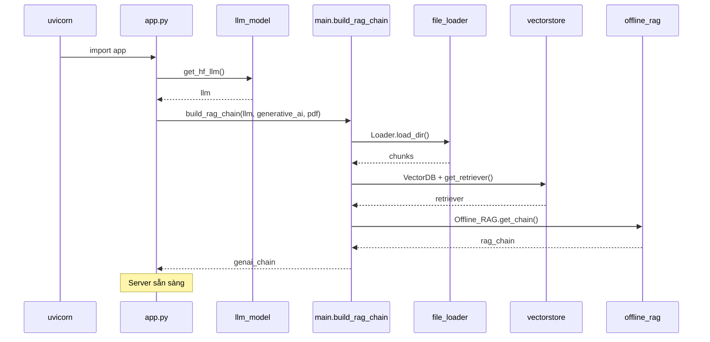

# RAG LangChain — Hướng dẫn chạy project

Repository xây dựng pipeline **RAG (Retrieval-Augmented Generation)** offline với LangChain, Chroma/FAISS, Hugging Face LLM (Llama 3.2 3B) và FastAPI + LangServe.

**Entry point chính:** `src/app.py` — khi khởi động server, app sẽ **tự load LLM**, **đọc toàn bộ PDF**, **build vector DB** và **tạo RAG chain** (không tách bước index riêng).

---

## Cấu trúc project

```
rag_langchain/
├── data_source/generative_ai/
│   ├── download.py          # Tải PDF arXiv
│   └── *.pdf                # Dữ liệu (cần có trước khi chạy app)
├── src/
│   ├── app.py               # FastAPI + LangServe
│   ├── base/
│   │   └── llm_model.py     # Load Llama 3.2 3B (4-bit)
│   └── rag/
│       ├── main.py          # build_rag_chain()
│       ├── file_loader.py   # Load & chunk PDF
│       ├── vectorstore.py   # Embedding + Chroma/FAISS
│       ├── offline_rag.py   # RAG chain (LCEL)
│       └── utils.py         # extract_answer (utility)
└── requirements.txt
```

### Luồng dữ liệu

```
data_source/generative_ai/*.pdf
         ↓
src/rag/main.py → build_rag_chain()
    → file_loader: PDF → chunks
    → vectorstore: chunks → embeddings → retriever
    → offline_rag: retriever + LLM + prompt
         ↓
src/app.py → uvicorn → API / Playground
```

| File | Vai trò |
|------|---------|
| `data_source/generative_ai/download.py` | Tải PDF arXiv |
| `src/rag/main.py` | `build_rag_chain`: load PDF → embed → RAG chain |
| `src/app.py` | FastAPI server, route `/generative_ai` |
| `src/base/llm_model.py` | Load Llama 3.2 3B (4-bit) |

---

## Yêu cầu hệ thống

| Thành phần | Ghi chú |
|------------|---------|
| **Python** | 3.10–3.11 khuyến nghị (torch 2.2.2) |
| **RAM** | ≥ 16 GB (load PDF + embedding + LLM) |
| **GPU** | Rất nên có NVIDIA + CUDA (4-bit `bitsandbytes`) |
| **macOS (Apple Silicon)** | `bitsandbytes` thường **khó/không** chạy 4-bit như Linux — có thể lỗi khi load model |
| **Disk** | Vài GB (model HF + embedding + PDF) |
| **Mạng** | Lần đầu: tải model HF, embedding, `hub.pull("rlm/rag-prompt")` |
| **Hugging Face** | Model `meta-llama/Llama-3.2-3B-Instruct` **gated** — cần tài khoản, chấp nhận license, token |

---

## Bước 1: Clone và vào thư mục project

```bash
cd /path/to/rag_langchain
```

Mọi lệnh sau chạy từ **root** repository.

---

## Bước 2: Virtual environment + cài dependency

```bash
python3 -m venv .venv
source .venv/bin/activate   # Windows: .venv\Scripts\activate
pip install -r requirements.txt
```

**Thiếu trong `requirements.txt` nhưng code vẫn dùng** — cài thêm:

```bash
pip install tqdm wget
```

---

## Bước 3: Hugging Face token (bắt buộc cho Llama)

1. Đăng ký / đăng nhập [huggingface.co](https://huggingface.co)
2. Vào trang model [meta-llama/Llama-3.2-3B-Instruct](https://huggingface.co/meta-llama/Llama-3.2-3B-Instruct) → chấp nhận điều khoản
3. Tạo Access Token: Settings → Access Tokens
4. Đăng nhập CLI:

```bash
huggingface-cli login
```

Hoặc:

```bash
export HF_TOKEN="hf_xxxxxxxx"
```

---

## Bước 4: Tải PDF vào đúng thư mục

App đọc PDF từ:

```text
./data_source/generative_ai/*.pdf
```

(cấu hình trong `src/app.py`: `genai_docs = "./data_source/generative_ai"`)

### Cách A — Chạy script tải (khuyến nghị)

```bash
cd data_source/generative_ai
python download.py
cd ../..
```

Script lưu file dạng `./{title}.pdf` **trong thư mục hiện tại** — nên `cd` vào `data_source/generative_ai` trước khi chạy.

### Cách B — Copy PDF có sẵn

Đặt file `.pdf` trực tiếp trong `data_source/generative_ai/` (không subfolder — `load_dir` chỉ `glob` `*.pdf` một cấp).

Kiểm tra:

```bash
ls data_source/generative_ai/*.pdf
```

Phải có **ít nhất 1 file**, nếu không `Loader.load_dir` sẽ fail.

---

## Bước 5: Chạy server

Đặt `PYTHONPATH` để import `src.*`:

```bash
export PYTHONPATH="${PWD}"
export TOKENIZERS_PARALLELISM=false

uvicorn src.app:app --host 0.0.0.0 --port 8000
```

**Lần khởi động đầu có thể rất lâu** (5–30+ phút tùy máy):

1. Tải / load **Llama 3.2 3B** (4-bit)
2. Load + chunk **tất cả PDF** (`workers=2` trong `src/rag/main.py`)
3. **Embed** toàn bộ chunk → Chroma
4. `hub.pull("rlm/rag-prompt")`
5. Ghép RAG chain

Chỉ khi xong các bước trên server mới listen port `8000`.

### Chạy nhanh (một dòng, sau khi đã có PDF + HF token)

```bash
cd /path/to/rag_langchain
source .venv/bin/activate
export PYTHONPATH="${PWD}"
uvicorn src.app:app --host 0.0.0.0 --port 8000
```

---

## Bước 6: Kiểm tra API

### Health check

```bash
curl http://localhost:8000/check
```

Kỳ vọng:

```json
{"status":"ok"}
```

### Hỏi RAG

```bash
curl -X POST http://localhost:8000/generative_ai \
  -H "Content-Type: application/json" \
  -d '{"question": "What is BERT?"}'
```

Kỳ vọng:

```json
{"answer":"..."}
```

### Swagger UI

Mở trình duyệt: [http://localhost:8000/docs](http://localhost:8000/docs)

### LangServe Playground

[http://localhost:8000/generative_ai/playground/](http://localhost:8000/generative_ai/playground/)

---

## Chạy RAG không qua API (tùy chọn)

Trong Python shell (từ root repo, đã activate venv):

```python
import os
os.environ["TOKENIZERS_PARALLELISM"] = "false"

from src.base.llm_model import get_hf_llm
from src.rag.main import build_rag_chain

llm = get_hf_llm(temperature=0.9)
chain = build_rag_chain(
    llm,
    data_dir="./data_source/generative_ai",
    data_type="pdf",
)

# Chain LCEL cần dict với key "question"
answer = chain.invoke({"question": "What is attention mechanism?"})
print(answer)
```

---

## Chi tiết pipeline khi server khởi động



### Giai đoạn 1 — Index (khi `build_rag_chain` chạy)

| Bước | Module | Input → Output |
|------|--------|----------------|
| Load PDF | `file_loader.py` | `.pdf` → `List[Document]` (chunks ~300 ký tự) |
| Embed | `vectorstore.py` | chunks → vectors trong Chroma |
| Chain | `offline_rag.py` | retriever + prompt Hub + LLM wrapper |

### Giai đoạn 2 — Query (mỗi câu hỏi)

```
question → retriever → top-k chunks → format_docs → context
         → prompt (context + question) → LLM → Str_OutputParser → answer
```

---

## API endpoints

| Method | Path | Mô tả |
|--------|------|--------|
| `GET` | `/check` | Health check |
| `POST` | `/generative_ai` | Body: `{"question": "..."}` → `{"answer": "..."}` |
| LangServe | `/generative_ai/playground/` | UI thử chain |

---

## Lỗi thường gặp và cách xử lý

### 1. `ModuleNotFoundError: No module named 'src'`

Chạy từ root repo và set:

```bash
export PYTHONPATH="${PWD}"
```

### 2. `No pdf files found in ...`

Chưa có PDF trong `data_source/generative_ai/` → làm **Bước 4**.

### 3. Lỗi Hugging Face / 401 / gated repo

Chưa login HF hoặc chưa accept license Llama → **Bước 3**.

### 4. `bitsandbytes` / CUDA trên Mac

`src/base/llm_model.py` dùng quantize 4-bit. Trên Mac có thể fail. Cần chỉnh code: bỏ `quantization_config`, chạy CPU/float16 (tùy chỉnh local).

### 5. `invoke` trong `app.py` có thể sai format

Hiện tại (`src/app.py`):

```python
answer = genai_chain.invoke(inputs.question)
```

Chain RAG dùng input dict với key `question`. Chuẩn LCEL thường là:

```python
answer = genai_chain.invoke({"question": inputs.question})
```

Nếu API trả lỗi kiểu key/Runnable, đổi sang dạng dict trên.

### 6. Thiếu `tqdm` / `wget`

```bash
pip install tqdm wget
```

### 7. Khởi động quá chậm / OOM (hết RAM/VRAM)

- Giảm số PDF để test (1–2 file)
- Trong `src/rag/main.py` đổi `workers=1`
- Giảm `k` retriever trong `src/rag/vectorstore.py` (mặc định `k=10`)
- Dùng model nhỏ hơn hoặc bỏ 4-bit trong `llm_model.py`

### 8. Import thừa (không chặn chạy)

- `src/rag/main.py`: `from turtle import title` — không dùng
- `src/rag/offline_rag.py`: import `pydoc`, `tokenize` thừa

---

## Checklist trước khi chạy

- [ ] Python 3.10+ và virtualenv
- [ ] `pip install -r requirements.txt`
- [ ] `pip install tqdm wget`
- [ ] `huggingface-cli login` + quyền truy cập Llama 3.2
- [ ] Ít nhất 1 file `data_source/generative_ai/*.pdf`
- [ ] `export PYTHONPATH="${PWD}"` từ root repo
- [ ] `uvicorn src.app:app --port 8000`
- [ ] Đợi load model + index xong
- [ ] `curl http://localhost:8000/check`
- [ ] `POST /generative_ai` với câu hỏi thử

---

## Ghi chú kỹ thuật

- **Embedding** (`HuggingFaceEmbeddings` trong `vectorstore.py`) và **LLM** (`llm_model.py`) là hai model khác nhau.
- Vector DB (Chroma) được tạo **in-memory** mỗi lần khởi động app — không persist ra disk; restart = index lại từ đầu.
- `file_loader.py` lọc ký tự non-ASCII (`ord(char) < 128`) — PDF tiếng Việt có thể mất nội dung.
- `Loader("pdf")` bắt buộc truyền `file_type="pdf"` (không có default).
